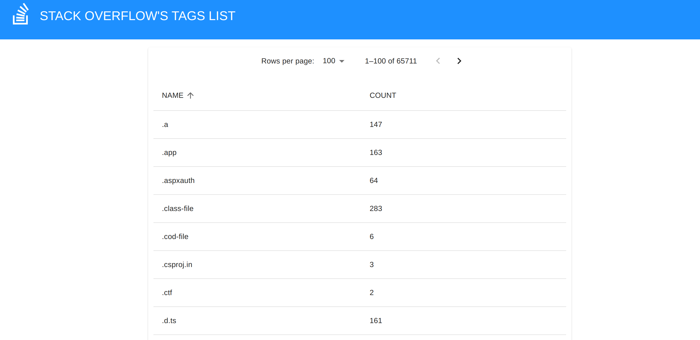

# 🎇 STACKTAG INSIGHT - a Stack Overflow's tags browser

## 💻 Technologies

### During ebsite is built with React, Typescript, HTML, CSS Modules, Vite and Vitest.

## 🚀 Installation

### After cloning repository to your local directory, install all dependencies:

      npm ci

### To run application use:

      npm start

### App is running on:

      http://localhost:5173/

### If you wish to check out app's Storybook use:

      npm run storybook

### To run tests use:

      npm run test
